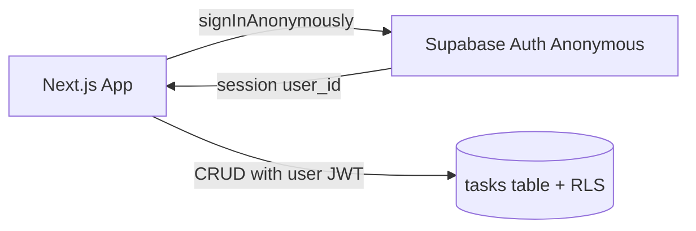

# DoitPlanit — Kanban Task Board

## Defaults (locked in)

- **Stack:** Next.js (App Router) + TypeScript + Tailwind CSS + `@dnd-kit`
- **Data:** Supabase JS client from the frontend (no custom API)
- **Auth:** Supabase anonymous sign-in on first load; tasks scoped by `user_id` + RLS
- **Project path:** `D:\Projects\doitplanit`
- **Hosting:** Vercel; live URL documented in README

You will need a free Supabase project (URL + anon key) before the app can talk to the database. Deployment will use the Vercel CLI or GitHub → Vercel.

---

## Architecture

**Data model** (`tasks`):

| Field         | Type        | Notes                                         |
| ------------- | ----------- | --------------------------------------------- |
| `id`          | uuid        | PK, default `gen_random_uuid()`               |
| `title`       | text        | required                                      |
| `description` | text        | optional                                      |
| `status`      | text        | `todo` | `in_progress` | `in_review` | `done` |
| `priority`    | text        | `low` | `normal` | `high`                     |
| `due_date`    | date        | optional                                      |
| `user_id`     | uuid        | `auth.uid()`                                  |
| `created_at`  | timestamptz | default `now()`                               |
| `position`    | numeric     | column order for stable DnD                   |

RLS policies: `SELECT` / `INSERT` / `UPDATE` / `DELETE` only when `auth.uid() = user_id`.

SQL lives in `supabase/migrations/001_tasks.sql` for one-click setup in the Supabase SQL editor.

---

## Design system (evaluation priority)

Avoid generic purple/cream AI defaults. Direction: **Linear-inspired cool slate + crisp accent**.

- **Palette:** near-black ink (`#0B0F14`), soft board canvas (`#F4F6F8`), column surfaces white with subtle border, accent teal (`#0D9488`) for primary actions / focus / high priority
- **Typography:** display + UI via Google fonts — **DM Sans** (UI) + **Fraunces** (brand wordmark only)
- **Board:** full-bleed horizontal columns; clear hierarchy (brand/header → columns → cards); no card-in-hero clutter
- **Cards:** compact, readable title; priority pip; due date; drag handle affordance; soft lift + shadow on drag
- **Motion:** column drop highlight, card lift/scale on drag, subtle column enter
- **States:** skeleton columns while loading; empty column illustration + CTA; toast/banner for auth or network errors

---

## App UX / features

1. **Boot:** `signInAnonymously()` → persist session → fetch tasks for that user
2. **Board:** four columns — To Do, In Progress, In Review, Done
3. **Create:** modal/drawer — title (required), description, priority, due date
4. **Drag-and-drop:** `@dnd-kit` multi-container; on drop → optimistic UI + `update` status (+ `position`)
5. **Edit/delete:** click card → detail panel (edit fields, delete)
6. **Responsive:** horizontal scroll on mobile; sticky column headers; touch-friendly drag sensors

Key files (after scaffold):

- `app/page.tsx` — board shell
- `components/board/*` — `Board`, `Column`, `TaskCard`, `CreateTaskModal`
- `lib/supabase/*` — client, auth bootstrap, task queries
- `app/globals.css` — CSS variables for palette
- `supabase/migrations/001_tasks.sql` — schema + RLS

---

## Implementation sequence

### Phase 1 — Scaffold
1. Create `D:\Projects\doitplanit` + git via `create_project`, then `move_agent_to_root`
2. Scaffold Next.js + Tailwind + deps (`@supabase/supabase-js`, `@dnd-kit/*`)

### Phase 2 — Supabase
- **2a.** Ship `supabase/migrations/001_tasks.sql` (schema + RLS); document run-in-SQL-editor steps
- **2b.** Browser client + `.env.local.example` (`NEXT_PUBLIC_SUPABASE_URL` / `NEXT_PUBLIC_SUPABASE_ANON_KEY`)
- **2c.** Anonymous guest sign-in on first launch; persist session
- **2d.** Task CRUD helpers (list / create / update / delete, including status + position)

### Phase 3 — Board UI
- **3a.** Design tokens, DM Sans + Fraunces, branded app shell
- **3b.** Static four-column board + task cards (wired to live data)
- **3c.** Create modal + edit/delete detail panel
- **3d.** `@dnd-kit` multi-container DnD with optimistic updates on drop

### Phase 4 — States & polish
- **4a.** Loading skeletons (auth + fetch)
- **4b.** Empty column / empty board CTAs
- **4c.** Error banners for auth, network, and failed mutations

### Phase 5 — Ship
8. Push to GitHub; deploy to Vercel; put live URL in README

---

## Deliverables

- Source in GitHub (`doitplanit`)
- Live Vercel demo URL in README
- Setup steps: Supabase project, paste env vars, run migration, `npm run dev` / deploy

